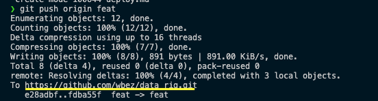
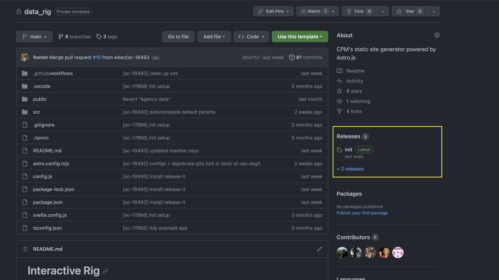

# Deployments

To get the most out of environments and code security, spend your development time in a git branch that is not `main`. 

- Create a new branch: `git checkout -b [branch name]`


## Stage Environment 

The stage build is setup to automatically attempt a build based on the `./config.js` org and s3Key variables whenever you push a pull request. This process assumes you are not in the `main` git branch. 

*Note* you do NOT need to merge your pull request to the main branch in order to create a stage build.

1. `git push origin [branch name]`

2. Follow the link exposed in the comments to create the pull request in github.



3. Create the pull request from github's interface.


## Production

The production build relies on github's release feature. When you setup a release in github, the main git branch builds to the production environment. Ensure your main git branch is up to date before releasing.

1. Navigate to the releases section of the github repo:



2. Click the button "Draft a new release"

3. Fill out the release form.
- The tag is required and must be unique. For example if this is your 2nd revision, the tag could be: `v2` or a `time-stamp`

4. When the information is ready, hit the green "Publish release" button


## Manual Deployments
Not recommended for general use, but if you need to troubleshoot a step you can manually deploy your project.

To use a different AWS CLI profile add the `--profile [YOUR_PROFILE]` flag at the end of the deploy commands below. Where `[YOUR_PROFILE]` is the name of your AWS CLI profile, for example `suntimes` or `default`.

### Steps

1. `npm run build:stage` or `npm run build:prod`

2. Use AWS CLI (be sure the profile for wbez or suntimes is correct based on your local aws credentials file)
```
aws s3 cp dist s3://interactive-stage.wbez.org/[sub-directory]/ --recursive  

aws s3 cp dist s3://suntimes-graphics-staging/[sub-directory]/ --recursive
```

Suntimes stage endpoint: http://suntimes-graphics-staging.s3-website-us-east-1.amazonaws.com/

See basic rig hosted on stage here: http://suntimes-graphics-staging.s3-website-us-east-1.amazonaws.com/astro-test/

